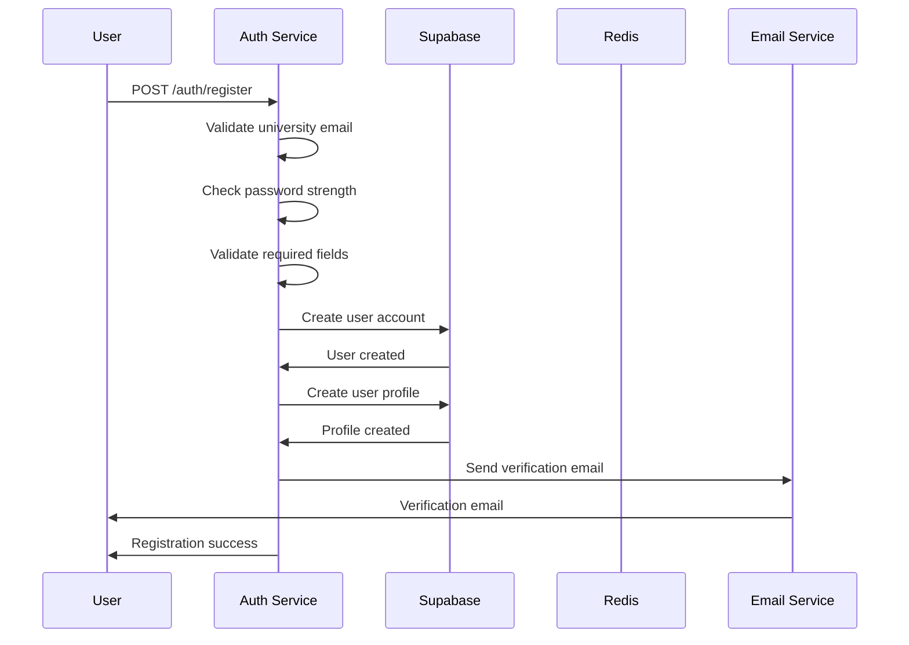
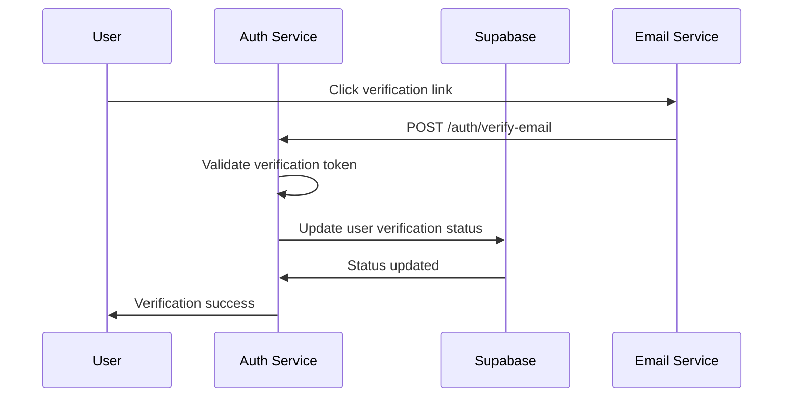
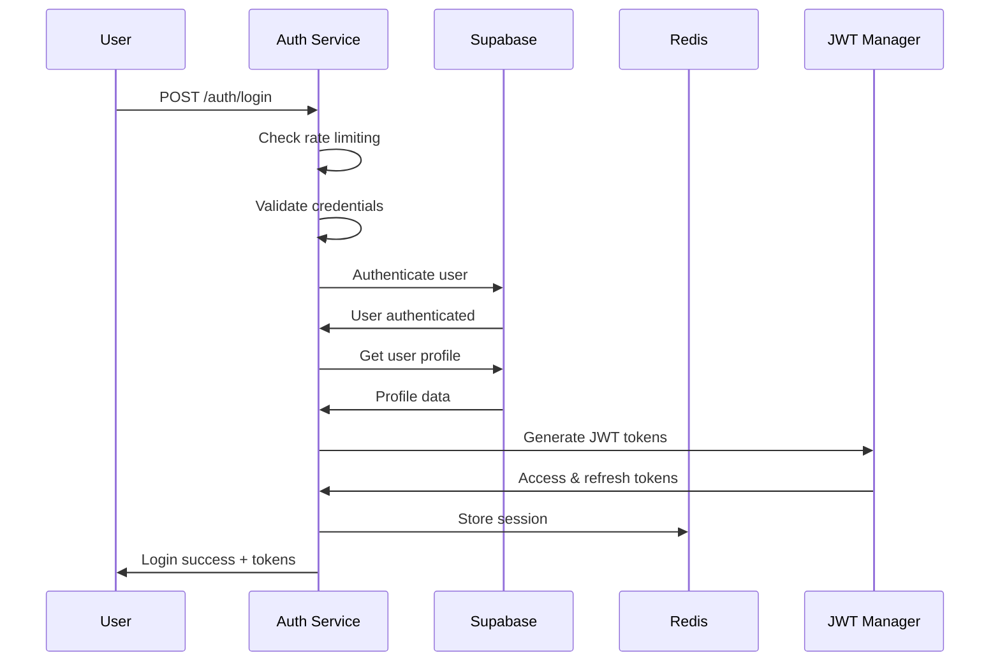
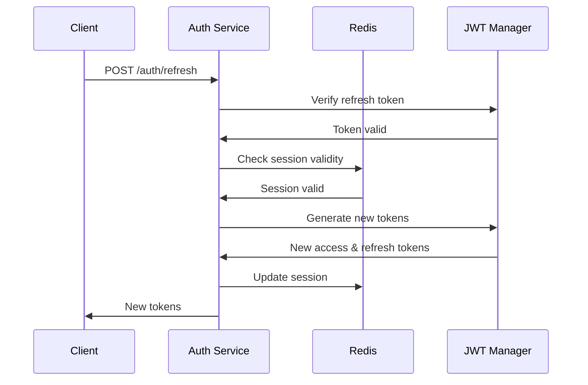
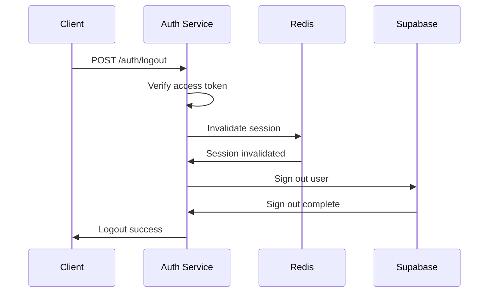

# ChitLaq Authentication System Guide

## Overview

The ChitLaq authentication system is built on Supabase Auth with custom JWT handling, providing secure, university-only registration and comprehensive session management. This guide covers the complete authentication flow, security features, and implementation details.

## Architecture

### Core Components

1. **Supabase Auth**: Handles user registration, login, and email verification
2. **Custom JWT Manager**: Manages access and refresh tokens with university-specific claims
3. **Session Manager**: Handles multi-device sessions and security
4. **University Email Validator**: Ensures only university emails can register
5. **Rate Limiting**: Prevents abuse and brute force attacks
6. **Fraud Detection**: Identifies and blocks suspicious activities

### Security Features

- **University Email Only**: Registration restricted to approved university domains
- **Email Verification**: Required before account activation
- **JWT with Short Expiration**: 15-minute access tokens
- **Refresh Token Rotation**: Automatic token rotation for security
- **Multi-Device Support**: Track and manage sessions across devices
- **Rate Limiting**: Prevent brute force attacks
- **Fraud Detection**: Advanced risk scoring and blocking
- **Session Management**: Secure session handling with Redis

## Authentication Flow

### 1. User Registration



**Registration Requirements:**
- Valid university email domain
- Strong password (8+ chars, uppercase, lowercase, number, special char)
- First name, last name, user type (student/faculty/staff)
- Department (for students)

**API Endpoint:**
```http
POST /auth/register
Content-Type: application/json

{
  "email": "john.doe@mit.edu",
  "password": "SecurePass123!",
  "confirmPassword": "SecurePass123!",
  "firstName": "John",
  "lastName": "Doe",
  "userType": "student",
  "department": "Computer Science"
}
```

**Response:**
```json
{
  "message": "Registration successful. Please check your email for verification.",
  "userId": "user-123",
  "requiresVerification": true
}
```

### 2. Email Verification



**API Endpoint:**
```http
POST /auth/verify-email
Content-Type: application/json

{
  "token": "verification-token-from-email"
}
```

### 3. User Login



**API Endpoint:**
```http
POST /auth/login
Content-Type: application/json

{
  "email": "john.doe@mit.edu",
  "password": "SecurePass123!"
}
```

**Response:**
```json
{
  "message": "Login successful",
  "user": {
    "id": "user-123",
    "email": "john.doe@mit.edu",
    "firstName": "John",
    "lastName": "Doe",
    "userType": "student",
    "department": "Computer Science",
    "universityName": "MIT",
    "isVerified": true
  },
  "tokens": {
    "accessToken": "eyJhbGciOiJIUzI1NiIsInR5cCI6IkpXVCJ9...",
    "refreshToken": "eyJhbGciOiJIUzI1NiIsInR5cCI6IkpXVCJ9..."
  }
}
```

### 4. Token Refresh



**API Endpoint:**
```http
POST /auth/refresh
Content-Type: application/json

{
  "refreshToken": "eyJhbGciOiJIUzI1NiIsInR5cCI6IkpXVCJ9..."
}
```

### 5. User Logout



## JWT Token Structure

### Access Token Claims

```json
{
  "sub": "user-123",
  "email": "john.doe@mit.edu",
  "university_id": "uni-1",
  "university_name": "MIT",
  "university_domain": "mit.edu",
  "user_type": "student",
  "department": "Computer Science",
  "verified": true,
  "iat": 1640995200,
  "exp": 1640996100,
  "iss": "chitlaq-auth-service",
  "aud": "chitlaq-app"
}
```

### Refresh Token Claims

```json
{
  "sub": "user-123",
  "email": "john.doe@mit.edu",
  "university_id": "uni-1",
  "deviceFingerprint": "device-123",
  "iat": 1640995200,
  "exp": 1641600000,
  "iss": "chitlaq-auth-service",
  "aud": "chitlaq-app"
}
```

## Security Features

### 1. University Email Validation

- **Domain Whitelist**: Only approved university domains allowed
- **Prefix Validation**: Some universities require specific email prefixes
- **Disposable Email Detection**: Blocks temporary email services
- **Real-time Validation**: Checks against live university database

### 2. Password Security

- **Strength Requirements**: 8+ characters, mixed case, numbers, special chars
- **Bcrypt Hashing**: Secure password storage
- **Password History**: Prevents password reuse
- **Reset Tokens**: Secure password reset flow

### 3. Session Management

- **Multi-Device Tracking**: Monitor sessions across devices
- **Session Invalidation**: Logout from specific or all devices
- **Activity Monitoring**: Track user activity and detect anomalies
- **Automatic Expiration**: Sessions expire after inactivity

### 4. Rate Limiting

- **Login Attempts**: 5 attempts per 5 minutes
- **Registration**: 10 attempts per hour
- **Password Reset**: 3 attempts per 15 minutes
- **API Calls**: Configurable per endpoint

### 5. Fraud Detection

- **Risk Scoring**: Algorithmic risk assessment
- **IP Analysis**: Monitor suspicious IP patterns
- **Device Fingerprinting**: Track device characteristics
- **Behavioral Analysis**: Detect unusual user behavior

## API Endpoints

### Authentication Endpoints

| Method | Endpoint | Description | Auth Required |
|--------|----------|-------------|---------------|
| POST | `/auth/register` | Register new user | No |
| POST | `/auth/login` | User login | No |
| POST | `/auth/logout` | User logout | Yes |
| POST | `/auth/refresh` | Refresh tokens | No |
| POST | `/auth/verify-email` | Verify email | No |
| POST | `/auth/resend-verification` | Resend verification | No |
| POST | `/auth/forgot-password` | Request password reset | No |
| POST | `/auth/reset-password` | Reset password | No |
| GET | `/auth/me` | Get current user | Yes |
| GET | `/auth/sessions` | Get active sessions | Yes |
| DELETE | `/auth/sessions/:deviceId` | Invalidate session | Yes |

### University Validation Endpoints

| Method | Endpoint | Description | Auth Required |
|--------|----------|-------------|---------------|
| POST | `/auth/validate-email` | Validate university email | No |
| GET | `/auth/universities` | List approved universities | No |

## Error Handling

### Common Error Responses

```json
{
  "error": "Error message",
  "code": "ERROR_CODE",
  "details": "Additional details",
  "timestamp": "2024-01-01T00:00:00Z"
}
```

### Error Codes

| Code | Description | HTTP Status |
|------|-------------|-------------|
| `INVALID_EMAIL` | Email domain not approved | 400 |
| `WEAK_PASSWORD` | Password doesn't meet requirements | 400 |
| `EMAIL_EXISTS` | Email already registered | 409 |
| `INVALID_CREDENTIALS` | Wrong email/password | 401 |
| `EMAIL_NOT_VERIFIED` | Email verification required | 403 |
| `TOKEN_EXPIRED` | Access token expired | 401 |
| `INVALID_TOKEN` | Invalid or malformed token | 401 |
| `RATE_LIMITED` | Too many requests | 429 |
| `SUSPICIOUS_ACTIVITY` | Fraud detection triggered | 403 |

## Frontend Integration

### React Hook Usage

```typescript
import { useAuth } from '../hooks/use-auth';

function LoginForm() {
  const { login, isLoading, error } = useAuth();

  const handleSubmit = async (e) => {
    e.preventDefault();
    try {
      await login(email, password);
      // Redirect to dashboard
    } catch (err) {
      // Handle error
    }
  };

  return (
    <form onSubmit={handleSubmit}>
      {/* Form fields */}
    </form>
  );
}
```

### Context Provider Setup

```typescript
import { AuthProvider } from '../context/auth-context';

function App() {
  return (
    <AuthProvider>
      <Router>
        {/* App routes */}
      </Router>
    </AuthProvider>
  );
}
```

## Security Best Practices

### 1. Token Storage

- **Access Tokens**: Store in memory only
- **Refresh Tokens**: Store in httpOnly cookies
- **Never**: Store tokens in localStorage

### 2. Request Headers

```typescript
const headers = {
  'Authorization': `Bearer ${accessToken}`,
  'Content-Type': 'application/json',
  'X-Device-Fingerprint': deviceFingerprint
};
```

### 3. Error Handling

- **Never**: Expose sensitive error details
- **Always**: Log errors server-side
- **Use**: Generic error messages for clients

### 4. Session Management

- **Monitor**: Active sessions regularly
- **Invalidate**: Suspicious sessions immediately
- **Rotate**: Refresh tokens on each use

## Monitoring and Logging

### Key Metrics

- **Authentication Success Rate**: Track login success/failure
- **Registration Rate**: Monitor new user signups
- **Token Refresh Rate**: Track token usage patterns
- **Session Duration**: Monitor user engagement
- **Fraud Detection**: Track blocked attempts

### Log Events

- **User Registration**: Email, university, timestamp
- **Login Attempts**: Success/failure, IP, device
- **Token Operations**: Generation, refresh, invalidation
- **Security Events**: Fraud detection, rate limiting
- **Session Management**: Creation, updates, invalidation

## Testing

### Unit Tests

```typescript
describe('Authentication Flow', () => {
  it('should register user successfully', async () => {
    const userData = {
      email: 'test@mit.edu',
      password: 'SecurePass123!',
      // ... other fields
    };

    const response = await request(app)
      .post('/auth/register')
      .send(userData);

    expect(response.status).toBe(201);
    expect(response.body.userId).toBeDefined();
  });
});
```

### Integration Tests

- **End-to-End Registration**: Complete registration flow
- **Login Flow**: Authentication with valid/invalid credentials
- **Token Refresh**: Token rotation and validation
- **Session Management**: Multi-device session handling
- **Rate Limiting**: Abuse prevention testing

### Security Tests

- **Penetration Testing**: Automated security scanning
- **Load Testing**: High-volume authentication testing
- **Fraud Simulation**: Test fraud detection systems
- **Token Security**: JWT manipulation attempts

## Deployment Considerations

### Environment Variables

```bash
# Supabase Configuration
SUPABASE_URL=https://your-project.supabase.co
SUPABASE_ANON_KEY=your-anon-key
SUPABASE_SERVICE_ROLE_KEY=your-service-role-key

# JWT Configuration
JWT_SECRET=your-super-secret-jwt-key
ACCESS_TOKEN_EXPIRATION=15m
REFRESH_TOKEN_EXPIRATION=7d

# Redis Configuration
REDIS_URL=redis://localhost:6379
REDIS_PASSWORD=your-redis-password

# Email Configuration
SMTP_HOST=smtp.gmail.com
SMTP_PORT=587
SMTP_USER=your-email@gmail.com
SMTP_PASS=your-app-password

# Security Configuration
RATE_LIMIT_WINDOW_MS=300000
RATE_LIMIT_MAX_ATTEMPTS=5
FRAUD_DETECTION_ENABLED=true
```

### Production Checklist

- [ ] Strong JWT secrets configured
- [ ] Rate limiting enabled
- [ ] Fraud detection active
- [ ] Email verification required
- [ ] HTTPS enforced
- [ ] Security headers configured
- [ ] Monitoring enabled
- [ ] Logging configured
- [ ] Backup procedures in place
- [ ] Incident response plan ready

## Troubleshooting

### Common Issues

1. **Email Verification Not Working**
   - Check SMTP configuration
   - Verify email templates
   - Check spam folders

2. **Token Expiration Issues**
   - Verify JWT secret configuration
   - Check token expiration settings
   - Ensure proper token refresh flow

3. **University Email Validation Fails**
   - Update university database
   - Check domain whitelist
   - Verify prefix validation rules

4. **Rate Limiting Too Strict**
   - Adjust rate limit settings
   - Check Redis configuration
   - Monitor rate limit logs

### Debug Mode

Enable debug logging for troubleshooting:

```bash
DEBUG=auth-service:* npm start
```

## Future Enhancements

### Planned Features

1. **OAuth Integration**: Google, Microsoft, GitHub login
2. **Multi-Factor Authentication**: SMS, TOTP, hardware keys
3. **Advanced Fraud Detection**: Machine learning models
4. **Session Analytics**: Detailed user behavior tracking
5. **Admin Dashboard**: User management interface
6. **API Rate Limiting**: Per-user API quotas
7. **Audit Logging**: Comprehensive security audit trail

### Scalability Considerations

- **Horizontal Scaling**: Multiple auth service instances
- **Database Sharding**: User data distribution
- **Caching Strategy**: Redis cluster for sessions
- **CDN Integration**: Global token validation
- **Microservices**: Split auth into smaller services

## Support and Maintenance

### Regular Tasks

- **Security Updates**: Keep dependencies updated
- **Monitoring Review**: Check metrics and alerts
- **Log Analysis**: Review authentication logs
- **Performance Tuning**: Optimize database queries
- **Backup Verification**: Test restore procedures

### Incident Response

1. **Detection**: Monitor alerts and metrics
2. **Assessment**: Determine severity and impact
3. **Containment**: Isolate affected systems
4. **Eradication**: Remove threats and vulnerabilities
5. **Recovery**: Restore normal operations
6. **Lessons Learned**: Document and improve

## Conclusion

The ChitLaq authentication system provides a robust, secure, and scalable foundation for university-only social networking. With comprehensive security features, detailed monitoring, and thorough testing, it ensures a safe and reliable user experience while maintaining the highest security standards.

For additional support or questions, please refer to the API documentation or contact the development team.
