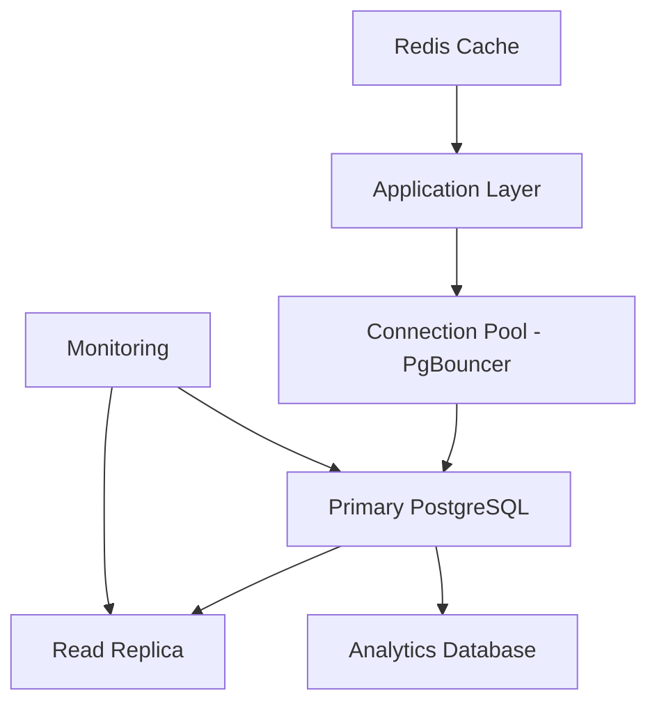
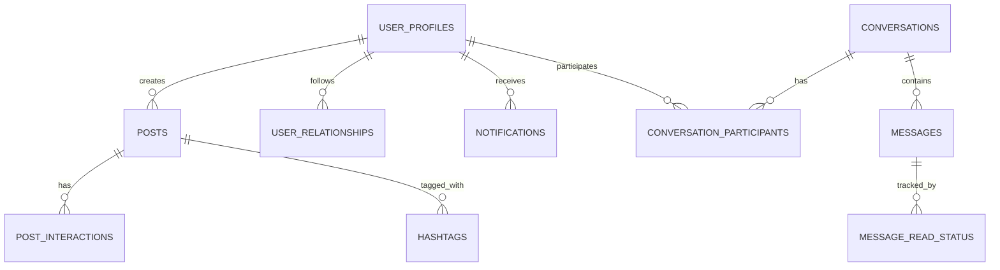

# ChitLaq M1 MVP - Database Design Documentation

> **Generated by PROMPT 1.3** - Database Schema & Migrations  
> **Senior Database Architect** - 15+ years PostgreSQL experience

## Table of Contents
- [Overview](#overview)
- [Database Architecture](#database-architecture)
- [Schema Design](#schema-design)
- [Performance Optimizations](#performance-optimizations)
- [Security Implementation](#security-implementation)
- [Migration Strategy](#migration-strategy)
- [Monitoring & Maintenance](#monitoring--maintenance)
- [Development Guidelines](#development-guidelines)

## Overview

ChitLaq M1 MVP uses a **performance-optimized PostgreSQL schema** designed for a university-focused social media platform. The database supports real-time messaging, content feeds, social relationships, and comprehensive analytics while maintaining strict security through Row Level Security (RLS) policies.

### Key Design Principles
- **Performance First**: Optimized indexes and query patterns
- **Security by Design**: RLS policies and data isolation
- **Scalability Ready**: Partitioning and materialized views
- **Analytics Friendly**: Comprehensive logging and metrics
- **University Focused**: Domain validation and academic features

## Database Architecture

### Primary Components


### Connection Strategy
- **PgBouncer** for connection pooling (transaction mode)
- **Read Replicas** for analytics and feed generation
- **Connection Pools** per service type (realtime, API, background)
- **SSL/TLS** encryption for all connections

## Schema Design

### Core Entity Relationships



### Table Structure Overview

#### User Management
- `user_profiles` - Core user data and preferences
- `user_relationships` - Following, blocking relationships
- `university_domains` - Approved educational domains

#### Content System
- `posts` - Text content with hashtags and mentions
- `post_interactions` - Likes, shares, saves
- `hashtags` - Trending topics and discovery

#### Messaging System
- `conversations` - Chat containers (DM/group)
- `messages` - Individual message content
- `message_read_status` - Read receipts tracking
- `conversation_participants` - Member management

#### Engagement & Discovery
- `notifications` - System and user notifications
- `user_interests` - Interest-based feed algorithm
- `feed_algorithm_data` - Personalization metrics

#### Analytics & Admin
- `analytics_events` - User behavior tracking
- `audit_logs` - Security and admin actions
- `system_config` - Application configuration
- `admin_actions` - Moderation tracking

### Key Data Types & Constraints

#### UUID Primary Keys
```sql
-- All primary keys use UUID for better distribution and security
id UUID PRIMARY KEY DEFAULT gen_random_uuid()
```

#### University Email Validation
```sql
-- Enforces educational domain requirements
CONSTRAINT valid_university_email CHECK (
    email ~* '^[a-zA-Z0-9._%+-]+@[a-zA-Z0-9.-]+\.[a-zA-Z]{2,}$' AND
    EXISTS (SELECT 1 FROM university_domains ud WHERE email ILIKE '%@' || ud.domain)
)
```

#### Content Length Limits
```sql
-- Post content optimization for performance
content TEXT NOT NULL CHECK (length(content) <= 2000)
bio TEXT CHECK (length(bio) <= 500)
```

## Performance Optimizations

### Indexing Strategy

#### Composite Indexes for Common Queries
```sql
-- Feed generation optimization
CREATE INDEX idx_posts_feed_optimization 
ON posts(created_at DESC, privacy_level) 
WHERE deleted_at IS NULL;

-- User relationships lookup
CREATE INDEX idx_user_relationships_compound 
ON user_relationships(follower_id, relationship_type, created_at DESC) 
WHERE deleted_at IS NULL;

-- Message querying with conversation
CREATE INDEX idx_messages_conversation_time 
ON messages(conversation_id, created_at DESC) 
WHERE deleted_at IS NULL;
```

#### Specialized Indexes
```sql
-- Full-text search
CREATE INDEX idx_posts_content_search ON posts USING gin(to_tsvector('english', content));

-- Hashtag searching
CREATE INDEX idx_posts_hashtags_gin ON posts USING gin(hashtags);

-- Geospatial (future expansion)
CREATE INDEX idx_user_profiles_location ON user_profiles USING gist(location);
```

### Query Optimization Patterns

#### Feed Algorithm Optimization
```sql
-- Materialized view for hot feed data
CREATE MATERIALIZED VIEW mv_user_feed_cache AS
SELECT 
    user_id,
    post_id,
    relevance_score,
    created_at
FROM posts p
JOIN user_relationships ur ON p.user_id = ur.following_id
WHERE p.created_at > NOW() - INTERVAL '7 days'
ORDER BY relevance_score DESC;

-- Refresh strategy
CREATE INDEX idx_mv_user_feed_cache_refresh ON mv_user_feed_cache(user_id, created_at DESC);
```

#### Conversation Performance
```sql
-- Optimized conversation listing with last message
CREATE OR REPLACE VIEW v_conversation_summary AS
SELECT 
    c.id,
    c.name,
    c.type,
    c.updated_at,
    (SELECT content FROM messages m 
     WHERE m.conversation_id = c.id 
     ORDER BY created_at DESC LIMIT 1) as last_message,
    (SELECT count(*) FROM conversation_participants cp 
     WHERE cp.conversation_id = c.id) as participant_count
FROM conversations c;
```

### Partitioning Strategy

#### Time-Based Partitioning
```sql
-- Analytics events partitioned by month
CREATE TABLE analytics_events_2024_01 PARTITION OF analytics_events
FOR VALUES FROM ('2024-01-01') TO ('2024-02-01');

-- Automated partition management
CREATE OR REPLACE FUNCTION create_monthly_partitions()
RETURNS void AS $$
BEGIN
    -- Auto-create next 3 months of partitions
    -- Implementation details in migration files
END;
$$ LANGUAGE plpgsql;
```

## Security Implementation

### Row Level Security (RLS)

#### User Data Protection
```sql
-- Users can only see their own private data
CREATE POLICY user_profiles_own_data ON user_profiles
FOR ALL TO authenticated
USING (auth.uid() = user_id);

-- Public profile data viewable by followers
CREATE POLICY user_profiles_public_view ON user_profiles
FOR SELECT TO authenticated
USING (
    privacy_level = 'public' OR
    auth.uid() = user_id OR
    EXISTS (
        SELECT 1 FROM user_relationships ur
        WHERE ur.follower_id = auth.uid()
        AND ur.following_id = user_id
        AND ur.relationship_type = 'following'
    )
);
```

#### Content Access Control
```sql
-- Posts visibility based on privacy settings
CREATE POLICY posts_visibility ON posts
FOR SELECT TO authenticated
USING (
    CASE privacy_level
        WHEN 'public' THEN true
        WHEN 'followers' THEN (
            user_id = auth.uid() OR
            EXISTS (
                SELECT 1 FROM user_relationships ur
                WHERE ur.follower_id = auth.uid()
                AND ur.following_id = posts.user_id
                AND ur.relationship_type = 'following'
            )
        )
        WHEN 'private' THEN user_id = auth.uid()
        ELSE false
    END
);
```

#### Messaging Security
```sql
-- Users can only access conversations they participate in
CREATE POLICY conversation_access ON conversations
FOR ALL TO authenticated
USING (
    EXISTS (
        SELECT 1 FROM conversation_participants cp
        WHERE cp.conversation_id = conversations.id
        AND cp.user_id = auth.uid()
    )
);
```

### Data Encryption & Hashing

#### Sensitive Data Protection
```sql
-- Email hashing for analytics (GDPR compliance)
CREATE OR REPLACE FUNCTION hash_email(email_addr text)
RETURNS text AS $$
BEGIN
    RETURN encode(digest(email_addr || current_setting('app.email_salt'), 'sha256'), 'hex');
END;
$$ LANGUAGE plpgsql SECURITY DEFINER;
```

#### Password Security
```sql
-- Handled by Supabase Auth, but custom validation functions
CREATE OR REPLACE FUNCTION validate_password_strength(password text)
RETURNS boolean AS $$
BEGIN
    -- Minimum 8 characters, uppercase, lowercase, number, special char
    RETURN password ~ '^(?=.*[a-z])(?=.*[A-Z])(?=.*\d)(?=.*[@$!%*?&])[A-Za-z\d@$!%*?&]{8,}$';
END;
$$ LANGUAGE plpgsql;
```

## Migration Strategy

### Migration File Structure
```
migrations/
├── 001_initial_schema.sql      # Core tables and relationships
├── 002_indexes_optimization.sql # Performance indexes
├── 003_rls_policies.sql        # Security policies
├── 004_functions_procedures.sql # Database functions
└── 005_triggers_views.sql      # Automation and views
```

### Migration Best Practices

#### Atomic Migrations
```sql
-- Each migration wrapped in transaction
BEGIN;

-- Schema changes here
CREATE TABLE IF NOT EXISTS new_feature (...);

-- Validation
DO $$
BEGIN
    IF NOT EXISTS (SELECT 1 FROM information_schema.tables WHERE table_name = 'new_feature') THEN
        RAISE EXCEPTION 'Migration validation failed: new_feature table not created';
    END IF;
END
$$;

COMMIT;
```

#### Rollback Preparation
```sql
-- Document rollback steps
/* 
ROLLBACK PLAN:
1. DROP TABLE new_feature;
2. Remove from migration_history;
3. Verify dependent objects
*/
```

### Version Control Integration
- **Conventional Commits** for migration naming
- **Code Review** mandatory for schema changes
- **Testing Pipeline** validates migrations in staging
- **Checksum Validation** prevents migration drift

## Monitoring & Maintenance

### Performance Monitoring

#### Query Performance Views
```sql
-- Top slow queries (requires pg_stat_statements)
SELECT 
    query,
    calls,
    total_time,
    mean_time,
    stddev_time
FROM pg_stat_statements
ORDER BY total_time DESC;
```

#### Index Usage Analysis
```sql
-- Unused indexes identification
SELECT 
    schemaname,
    tablename,
    indexname,
    pg_size_pretty(pg_relation_size(indexrelid)) as size
FROM pg_stat_user_indexes
WHERE idx_scan = 0;
```

### Automated Maintenance

#### Vacuum Strategy
```sql
-- Custom vacuum settings for high-traffic tables
ALTER TABLE posts SET (
    autovacuum_vacuum_scale_factor = 0.1,
    autovacuum_analyze_scale_factor = 0.05
);

ALTER TABLE messages SET (
    autovacuum_vacuum_scale_factor = 0.05,
    autovacuum_analyze_scale_factor = 0.02
);
```

#### Statistics Updates
```sql
-- Automated statistics refresh
CREATE OR REPLACE FUNCTION refresh_table_statistics()
RETURNS void AS $$
BEGIN
    ANALYZE posts;
    ANALYZE messages;
    ANALYZE user_relationships;
    ANALYZE post_interactions;
END;
$$ LANGUAGE plpgsql;
```

### Backup & Recovery

#### Backup Strategy
- **Full Backup**: Daily at 2 AM UTC
- **Incremental**: Every 6 hours using WAL-E
- **Point-in-Time Recovery**: 30-day retention
- **Cross-Region Replication**: For disaster recovery

#### Recovery Testing
```bash
# Monthly recovery test procedure
pg_dump chitlaq_main > backup_test.sql
createdb chitlaq_recovery_test
psql chitlaq_recovery_test < backup_test.sql
# Validate data integrity
dropdb chitlaq_recovery_test
```

## Development Guidelines

### Schema Change Process

#### 1. Planning Phase
- **Impact Assessment**: Analyze affected queries and tables
- **Performance Testing**: Benchmark changes in staging
- **Rollback Strategy**: Document reversal steps
- **Team Review**: Technical review of changes

#### 2. Implementation Phase
```sql
-- Migration template
-- Migration: [NUMBER]_[DESCRIPTION].sql
-- Author: [NAME]
-- Date: [YYYY-MM-DD]
-- Description: [DETAILED DESCRIPTION]

BEGIN;

-- Pre-migration checks
DO $$
BEGIN
    -- Validation logic here
END
$$;

-- Schema changes
[CHANGES HERE]

-- Post-migration validation
DO $$
BEGIN
    -- Validation logic here
END
$$;

COMMIT;
```

#### 3. Deployment Phase
- **Staging Deployment**: Test with production-like data
- **Performance Validation**: Monitor query performance
- **Production Deployment**: During low-traffic window
- **Post-Deployment Monitoring**: Watch for issues

### Query Optimization Guidelines

#### Efficient Query Patterns
```sql
-- ✅ Good: Use indexes effectively
SELECT * FROM posts 
WHERE user_id = $1 AND created_at > $2 
ORDER BY created_at DESC 
LIMIT 20;

-- ❌ Bad: Causes full table scan
SELECT * FROM posts 
WHERE content LIKE '%keyword%'
ORDER BY created_at DESC;

-- ✅ Better: Use full-text search
SELECT * FROM posts 
WHERE to_tsvector('english', content) @@ plainto_tsquery('english', $1)
ORDER BY ts_rank(to_tsvector('english', content), plainto_tsquery('english', $1)) DESC;
```

#### Index Design Principles
1. **Leading Column**: Most selective column first
2. **Query Patterns**: Match common WHERE clauses
3. **Sort Optimization**: Include ORDER BY columns
4. **Partial Indexes**: For filtered queries
5. **Covering Indexes**: Include SELECT columns when beneficial

### Testing Strategy

#### Unit Tests for Functions
```sql
-- Test data validation functions
DO $$
BEGIN
    -- Test valid email
    ASSERT validate_university_email('student@metu.edu.tr') = true;
    
    -- Test invalid email
    ASSERT validate_university_email('invalid@gmail.com') = false;
    
    -- Test edge cases
    ASSERT validate_university_email('') = false;
    ASSERT validate_university_email(NULL) = false;
END
$$;
```

#### Performance Tests
```sql
-- Benchmark critical queries
EXPLAIN (ANALYZE, BUFFERS) 
SELECT * FROM posts 
WHERE user_id = '...' AND created_at > NOW() - INTERVAL '1 day'
ORDER BY created_at DESC 
LIMIT 20;
```

## Conclusion

This database design provides a **solid foundation** for ChitLaq M1 MVP with:

- **🚀 Performance**: Optimized for university social media workloads
- **🔒 Security**: Comprehensive RLS and data protection
- **📈 Scalability**: Ready for growth with partitioning and replicas
- **🔧 Maintainability**: Clear migration strategy and monitoring
- **🎓 University Focus**: Domain validation and academic features

The schema supports **real-time messaging**, **content feeds**, **social relationships**, and **comprehensive analytics** while maintaining strict security and performance standards.

---

**Next Steps**: Proceed to **PROMPT 1.4** for API Gateway and authentication layer implementation.

> 📝 **Documentation Version**: 1.0  
> 📅 **Last Updated**: 2024  
> 👨‍💻 **Maintained by**: ChitLaq Development Team
