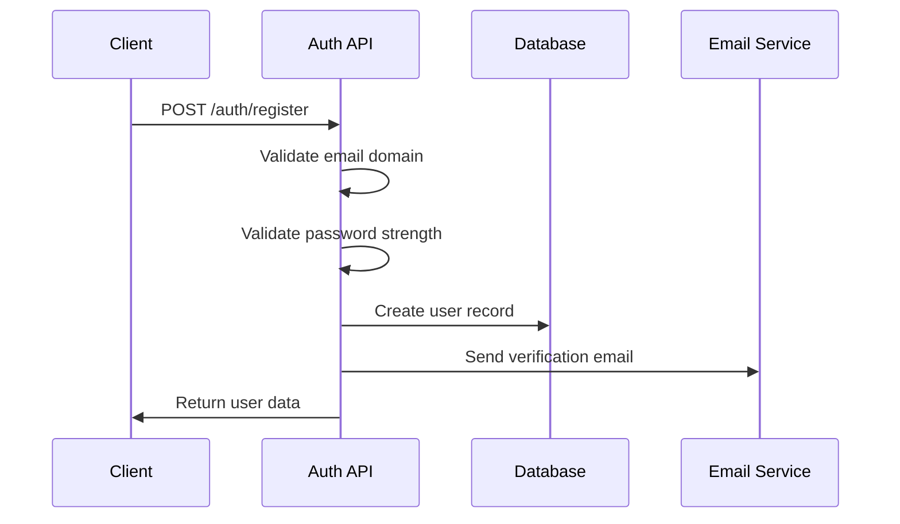
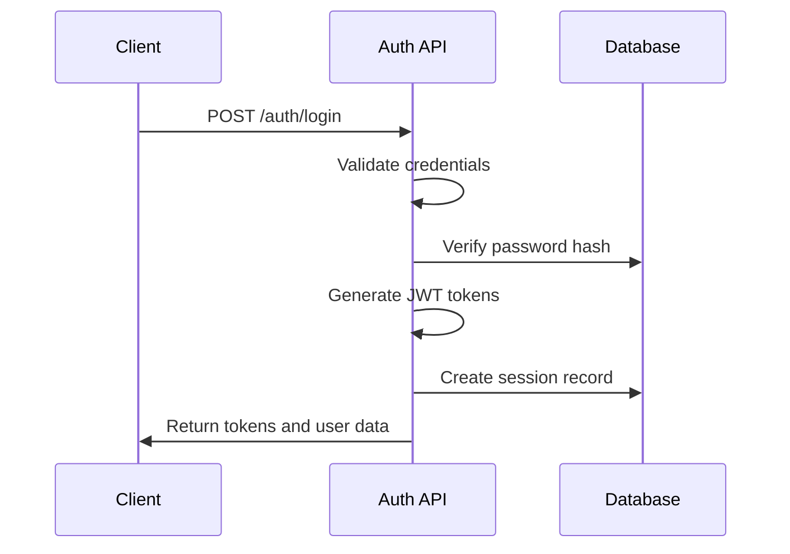
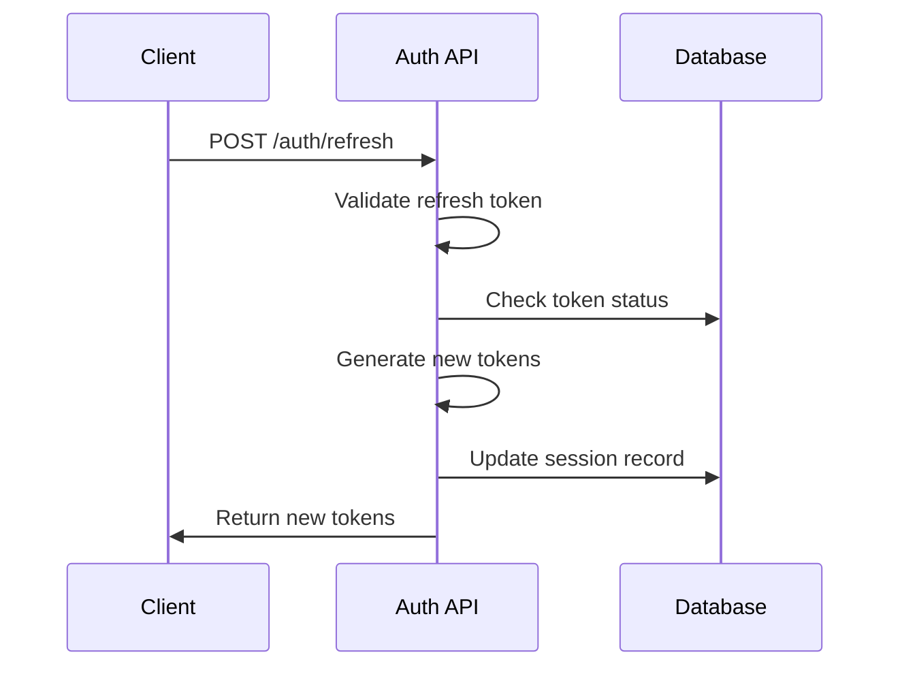
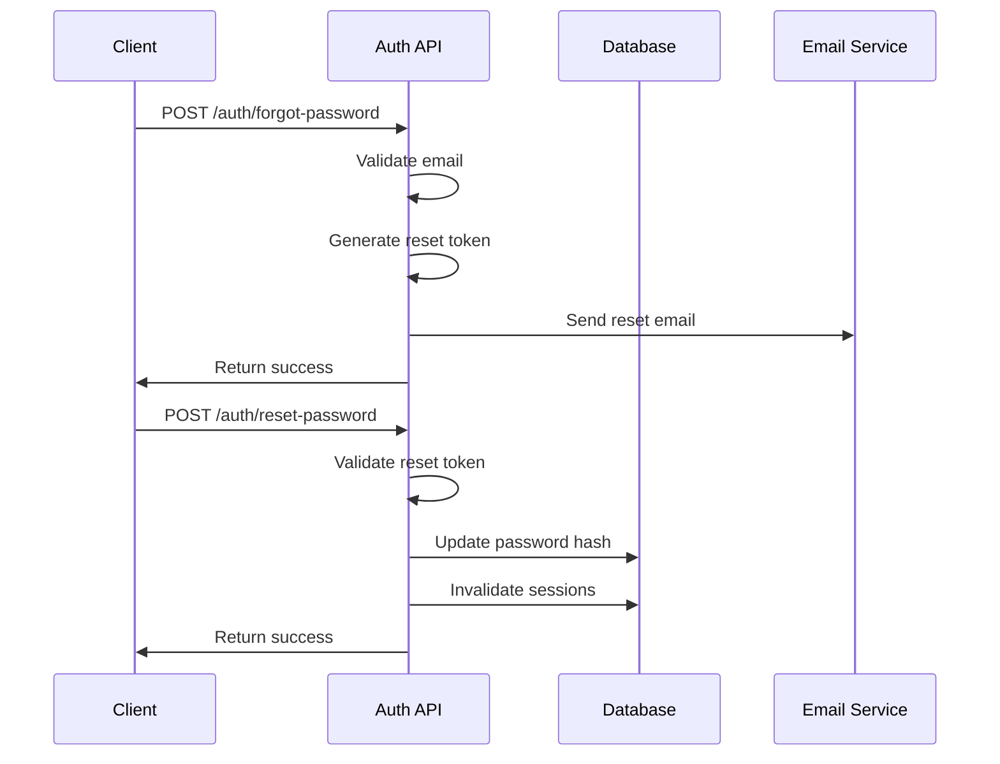

# Authentication Flow Documentation

## Overview

This document provides detailed information about the ChitLaq authentication flows, including user registration, login, session management, and security features.

## Table of Contents

1. [User Registration Flow](#user-registration-flow)
2. [User Login Flow](#user-login-flow)
3. [Session Management](#session-management)
4. [Password Reset Flow](#password-reset-flow)
5. [Email Verification Flow](#email-verification-flow)
6. [Token Refresh Flow](#token-refresh-flow)
7. [Security Features](#security-features)
8. [Error Handling](#error-handling)
9. [Flow Diagrams](#flow-diagrams)

## User Registration Flow

### Overview

The registration flow ensures only valid university students can create accounts by validating email domains and implementing security measures.

### Step-by-Step Process

1. **Email Validation**
   - Client sends registration request with university email
   - Server validates email format and domain against approved universities
   - Server checks for disposable email addresses
   - Server validates email prefix (student, alumni, etc.)

2. **Password Validation**
   - Server validates password strength requirements
   - Password must be 8+ characters with uppercase, lowercase, number, and special character
   - Server hashes password using bcrypt with salt rounds

3. **User Creation**
   - Server creates user record in database
   - Server generates email verification token
   - Server sends verification email

4. **Response**
   - Server returns user data (without sensitive information)
   - Client receives confirmation and instructions for email verification

### API Endpoint

```http
POST /auth/register
Content-Type: application/json

{
  "email": "student@university.edu",
  "password": "SecurePassword123!",
  "confirmPassword": "SecurePassword123!",
  "firstName": "John",
  "lastName": "Doe"
}
```

### Response

```json
{
  "success": true,
  "data": {
    "userId": "user_123456789",
    "email": "student@university.edu",
    "firstName": "John",
    "lastName": "Doe",
    "universityId": "1",
    "isEmailVerified": false,
    "createdAt": "2023-12-01T10:00:00Z"
  },
  "message": "User registered successfully. Please verify your email."
}
```

### Security Measures

- **Rate Limiting**: 5 registrations per hour per IP
- **Email Validation**: Strict university domain validation
- **Password Hashing**: bcrypt with 12 salt rounds
- **Fraud Detection**: Disposable email detection
- **Audit Logging**: All registration attempts logged

## User Login Flow

### Overview

The login flow authenticates users and establishes secure sessions with JWT tokens.

### Step-by-Step Process

1. **Credential Validation**
   - Client sends email and password
   - Server validates email format and university domain
   - Server checks for account lockout status

2. **Authentication**
   - Server verifies password against stored hash
   - Server checks email verification status
   - Server validates account status (active, not suspended)

3. **Session Creation**
   - Server generates JWT access token (1 hour expiry)
   - Server generates refresh token (30 days expiry)
   - Server creates session record in database
   - Server logs successful login

4. **Response**
   - Server returns tokens and user data
   - Client stores tokens securely
   - Client can now make authenticated requests

### API Endpoint

```http
POST /auth/login
Content-Type: application/json

{
  "email": "student@university.edu",
  "password": "SecurePassword123!"
}
```

### Response

```json
{
  "success": true,
  "data": {
    "accessToken": "eyJhbGciOiJIUzI1NiIsInR5cCI6IkpXVCJ9...",
    "refreshToken": "eyJhbGciOiJIUzI1NiIsInR5cCI6IkpXVCJ9...",
    "expiresIn": 3600,
    "user": {
      "id": "user_123456789",
      "email": "student@university.edu",
      "firstName": "John",
      "lastName": "Doe",
      "universityId": "1",
      "isEmailVerified": true
    }
  },
  "message": "Login successful"
}
```

### Security Measures

- **Rate Limiting**: 10 login attempts per 5 minutes per IP
- **Brute Force Protection**: Account lockout after 5 failed attempts
- **JWT Security**: Signed tokens with expiration
- **Session Tracking**: Multi-device session management
- **Audit Logging**: All login attempts logged

## Session Management

### Overview

Session management handles token lifecycle, multi-device support, and security monitoring.

### Token Types

1. **Access Token**
   - Short-lived (1 hour)
   - Used for API authentication
   - Contains user claims and permissions
   - Automatically refreshed when expired

2. **Refresh Token**
   - Long-lived (30 days)
   - Used to obtain new access tokens
   - Stored securely on server
   - Revoked on logout or security events

### Multi-Device Support

- Users can be logged in on multiple devices
- Each device has separate session tokens
- Sessions can be managed individually
- Logout from one device doesn't affect others

### Session Security

- **Token Rotation**: Refresh tokens are rotated on each use
- **Device Tracking**: Sessions tied to device fingerprints
- **Geolocation**: Login location tracking for security
- **Suspicious Activity**: Automatic session termination for suspicious behavior

## Password Reset Flow

### Overview

The password reset flow allows users to securely reset their passwords using email verification.

### Step-by-Step Process

1. **Reset Request**
   - User requests password reset with email
   - Server validates email and university domain
   - Server generates secure reset token
   - Server sends reset email with token

2. **Email Verification**
   - User clicks reset link in email
   - Client extracts token from URL
   - Token is validated for expiration and format

3. **Password Reset**
   - User submits new password with token
   - Server validates token and password strength
   - Server updates password hash
   - Server invalidates all existing sessions
   - Server sends confirmation email

### API Endpoints

#### Request Password Reset

```http
POST /auth/forgot-password
Content-Type: application/json

{
  "email": "student@university.edu"
}
```

#### Reset Password

```http
POST /auth/reset-password
Content-Type: application/json

{
  "token": "reset_token_123456",
  "newPassword": "NewSecurePassword123!",
  "confirmPassword": "NewSecurePassword123!"
}
```

### Security Measures

- **Token Expiration**: Reset tokens expire in 1 hour
- **Single Use**: Tokens can only be used once
- **Rate Limiting**: 3 reset requests per hour per email
- **Session Invalidation**: All sessions invalidated on password change
- **Audit Logging**: All password reset attempts logged

## Email Verification Flow

### Overview

Email verification ensures users have access to their university email addresses.

### Step-by-Step Process

1. **Verification Request**
   - User registers or requests verification
   - Server generates verification token
   - Server sends verification email

2. **Email Verification**
   - User clicks verification link
   - Client extracts token from URL
   - Server validates token and marks email as verified

3. **Account Activation**
   - User account is fully activated
   - User can access all features
   - Verification status updated in database

### API Endpoints

#### Verify Email

```http
POST /auth/verify-email
Content-Type: application/json

{
  "token": "verify_token_123456"
}
```

#### Resend Verification

```http
POST /auth/resend-verification
Content-Type: application/json

{
  "email": "student@university.edu"
}
```

### Security Measures

- **Token Expiration**: Verification tokens expire in 24 hours
- **Rate Limiting**: 3 verification emails per hour per email
- **Single Use**: Tokens can only be used once
- **Audit Logging**: All verification attempts logged

## Token Refresh Flow

### Overview

The token refresh flow maintains user sessions without requiring re-authentication.

### Step-by-Step Process

1. **Token Expiration Detection**
   - Client detects access token expiration (401 response)
   - Client automatically attempts token refresh

2. **Refresh Request**
   - Client sends refresh token to server
   - Server validates refresh token
   - Server checks token expiration and revocation status

3. **New Token Generation**
   - Server generates new access token
   - Server generates new refresh token (rotation)
   - Server updates session record

4. **Response**
   - Server returns new tokens
   - Client updates stored tokens
   - Client retries original request

### API Endpoint

```http
POST /auth/refresh
Content-Type: application/json

{
  "refreshToken": "eyJhbGciOiJIUzI1NiIsInR5cCI6IkpXVCJ9..."
}
```

### Response

```json
{
  "success": true,
  "data": {
    "accessToken": "eyJhbGciOiJIUzI1NiIsInR5cCI6IkpXVCJ9...",
    "refreshToken": "eyJhbGciOiJIUzI1NiIsInR5cCI6IkpXVCJ9...",
    "expiresIn": 3600
  }
}
```

### Security Measures

- **Token Rotation**: Refresh tokens are rotated on each use
- **Expiration**: Refresh tokens expire in 30 days
- **Revocation**: Tokens can be revoked for security
- **Audit Logging**: All refresh attempts logged

## Security Features

### Threat Detection

1. **Brute Force Protection**
   - Account lockout after 5 failed attempts
   - IP-based rate limiting
   - Progressive delays for repeated failures

2. **Fraud Detection**
   - Disposable email detection
   - Suspicious activity monitoring
   - Geolocation-based alerts

3. **Session Security**
   - Device fingerprinting
   - Concurrent session limits
   - Automatic session termination

### Audit Logging

All authentication events are logged with:
- User ID and email
- IP address and user agent
- Timestamp and action type
- Success/failure status
- Additional metadata

### Compliance

- **GDPR**: Data protection and user rights
- **FERPA**: Educational data privacy
- **SOC 2**: Security and availability controls

## Error Handling

### Error Response Format

```json
{
  "success": false,
  "error": "Human-readable error message",
  "code": "MACHINE_READABLE_CODE",
  "details": {
    "field": "email",
    "value": "invalid-email"
  },
  "timestamp": "2023-12-01T10:00:00Z",
  "requestId": "req_123456789"
}
```

### Common Error Scenarios

1. **Validation Errors**
   - Invalid email format
   - Weak password
   - Missing required fields

2. **Authentication Errors**
   - Invalid credentials
   - Account locked
   - Email not verified

3. **Security Errors**
   - Rate limit exceeded
   - Suspicious activity
   - Token expired

4. **System Errors**
   - Database connection failed
   - Email service unavailable
   - Internal server error

## Flow Diagrams

### Registration Flow



### Login Flow



### Token Refresh Flow



### Password Reset Flow



## Best Practices

### Client Implementation

1. **Token Storage**
   - Use secure storage (not localStorage)
   - Implement token refresh logic
   - Handle token expiration gracefully

2. **Error Handling**
   - Implement retry logic for network errors
   - Show user-friendly error messages
   - Log errors for debugging

3. **Security**
   - Validate inputs client-side
   - Use HTTPS in production
   - Implement proper logout

### Server Implementation

1. **Security**
   - Implement rate limiting
   - Use secure password hashing
   - Validate all inputs

2. **Monitoring**
   - Log all authentication events
   - Monitor for suspicious activity
   - Set up alerts for security events

3. **Performance**
   - Cache frequently accessed data
   - Optimize database queries
   - Implement connection pooling

## Troubleshooting

### Common Issues

1. **Token Expired**
   - Implement automatic token refresh
   - Handle 401 responses gracefully
   - Redirect to login if refresh fails

2. **Rate Limiting**
   - Implement exponential backoff
   - Show user-friendly messages
   - Monitor rate limit headers

3. **Email Issues**
   - Check spam folders
   - Verify email domain
   - Contact support if needed

### Debug Information

Include request ID in support requests:
```json
{
  "requestId": "req_123456789",
  "timestamp": "2023-12-01T10:00:00Z",
  "error": "Token expired"
}
```

## Support

- **Documentation**: [https://docs.chitlaq.com](https://docs.chitlaq.com)
- **API Status**: [https://status.chitlaq.com](https://status.chitlaq.com)
- **Support Email**: api-support@chitlaq.com
- **Community**: [https://community.chitlaq.com](https://community.chitlaq.com)
